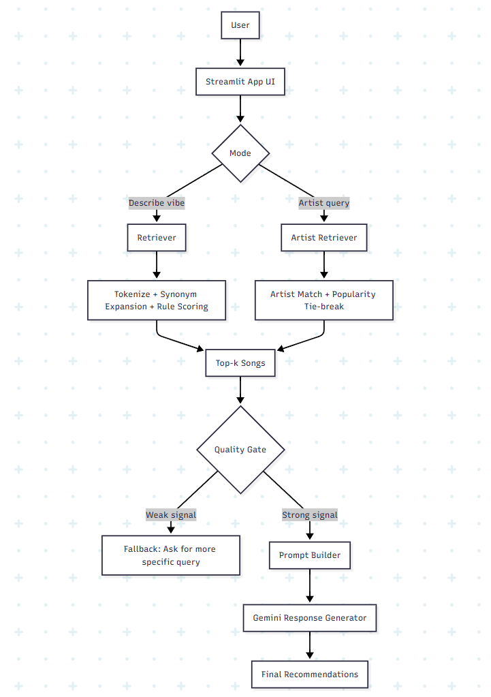
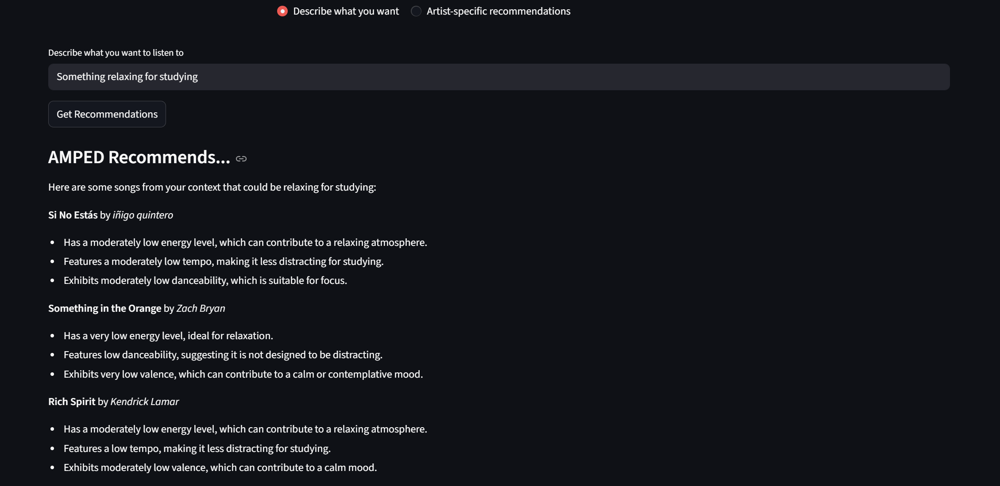
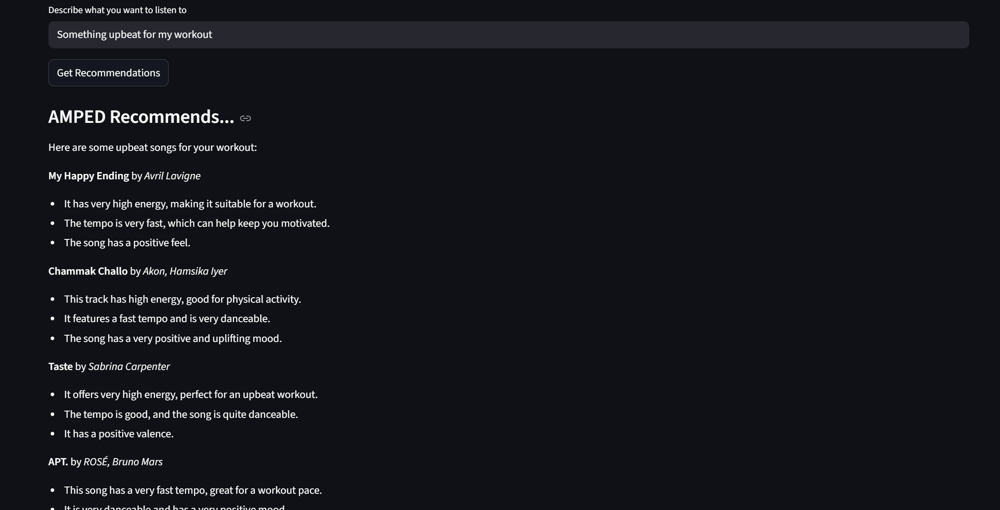
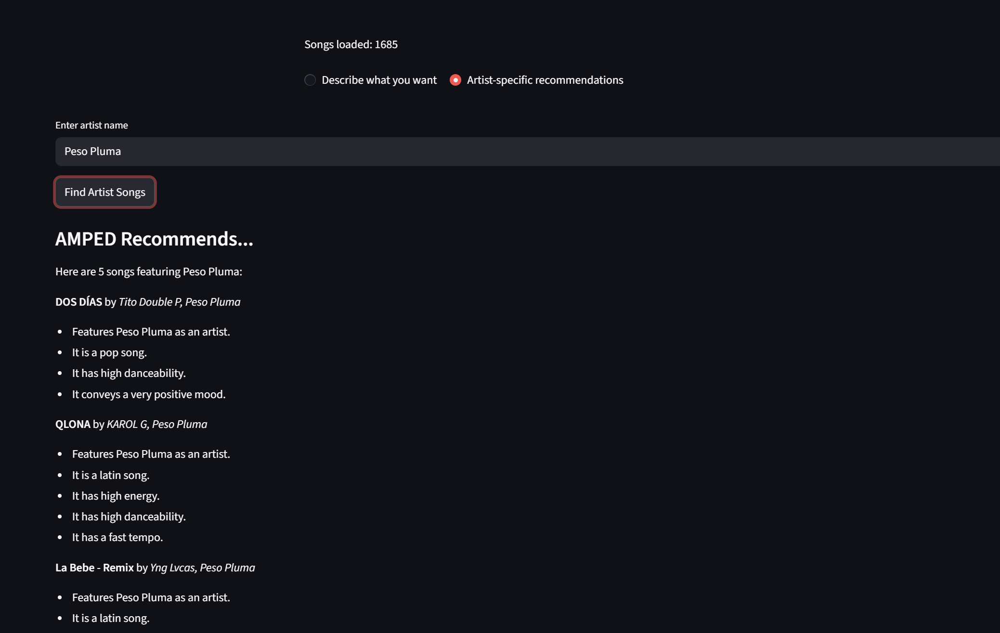

## Original Project
- The name of the original project from which this new project was extended is called the Music Recommender Simulator. Its original goals were to recommend songs based on word and numeric input from the user. The system recommended songs based on mathematical similarity with the numeric inputs, as well as keyword similarity.

## More about the extended project -Title & Summary
- The extended project name is AMPED, an AI DJ that will recommend you songs. The overall goal towards this project was to make it so instead of numeric values being inputted, since realistically most users dont search songs based on a point scale of features like for example: energy, a user can type in actual prompts, and sentences, from which the program can work with to determine what songs to display and recommend. Using RAG as well as the LLM Gemini, the program will help correctly display and describe proper songs that match what the user is looking for. Having new features like these combined with a beginner friendly User Interface will help in user more user attraction and motivation to want to use the program.

## System Diagram Representation

- The system diagram represents the overall flow and process of input by the user. Starting with the streamlit UI, the user has two modes from which they can pick, describe mode: they write a short query describing the music, or artist mode: typing an specific artist from which songs will be recommended. After user inputs a prompt or artist name, the retreival happens. In describe mode, each token is passed to find any key words or synonyms to properly look for in the song database. In artist mode, songs with the exact artist name are looked for. The program uses a point system for the describe mode, as well as bonus-points that can be earned when more tokens are matched. After retreival, the system gathers the top-k songs(up to 5) which most describe what the user is looking for. In order to fully check whether songs retreived are accurate, guardrails are in place to double-check similarity of the songs retrieved. When the songs are checked and confirmed, they are sent to the Gemini with a prompt to display the songs and explain why they are recommended.

## Setup instructions

- In order to run the code, ensure the requirements.txt file is installed.
- Enter "pip install -r requirements.txt" in the terminal to install features used in the program.
- In order for this program to function with Gemini, create your own API key by using the Google AI Studio. You can follow the link at https://aistudio.google.com.
- After creating an API key, copy it and paste it onto the placeholder in the .env file.

- Shortly after, ensure in the terminal you are in the correct folder to run the program. The folder is called "applied-ai-systems-project".
- To ensure you are in the correct folder, you can type "cd applied-ai-systems-project".

- Once in the correct folder, run the program with "python -m streamlit run src/app.py".
- A window should open and the UI should display. Now you can begin use.

## Sample Interactions
- Here are some example inputs to show the program's AI outputs & to demonstrate the system is functional.

## Test Cases
There are pytests conducted in tests/test_rag.py to ensure program features like proper retrieval of songs, guardrails when little to no songs are returned, and proper synonym connection are passed. This helps ensure the overall functionality of the program. There are a total of 9 pytests.

## Design Decisions
- The reason for this specific build was to try to get the most "exact" results out of the retrieval. Using more of a rule-based approach for retrieval, this made it finding exact keywords from the query were the most important. After the exact keyword search, other features like synonyms of keywords were searched for as well, to ensure no missing or mistakes can be made when retrieving the information, and to have more accurate results. Some trade-offs I made were to not display ALL of the songs that were correctly matched and retrieved from the retrieval process, in order for the program to recommend results faster. I noticed that overall, up to 5 top songs that were displayed was a good standpoint to be in.

## Testing Summary 
- The finalized result was a proper AI based recommendation system! The program works as intended and therefore successfully recommend music based on the mode chosen. Although the program worked sucessfully, it has a harder time dealing with more complex queries, like non-common features that a person may like. This is due to the fact that since the program has more of a rule-based approach for retrieval, which is the key part in what to recommend, it may not recognize what could be synonyms when comparing tokens. In conclusion, I learned the true process and the core of a RAG system, and its already given me ideas for other projects too! I'd love to use RAG more in future projects when the chance is available. With the knowledege I've aquired from doing this project, I'm sure I would be able to make my next RAG system more accurate.

## Post-Project Reflection, Ethics
- One limitation is that when in artist mode, it is harder to recommend proper songs if something like misspelling happens. This goes the same with complex descriptions inputted to by the user, as talked about before. This is due to the fact that the search and retrieval uses more of a rule-based approach, which can limit non-common queries when inputted. A way the AI can be missued could be prompt abuse in general, since the query typed in is also sent to the LLM. This could be prevented by bettering the prompt rules, as well as rules towards the LLM when sending the query to ensure security and proper output. 

- One thing that did surprise me when testing the AI reliability was the difference in song recommendations with the change of ONE word. For example, the difference between the results of "chill study" vs. "calm study". The AI can still produce accurate results, but the song choices can be different. It made me think about how the process behind the overall retrieval system works and how Gemini displays them.

- One collaboration I made in this project was when working towards building a UI for the program. Since I am not that familiar with streamlit, I asked Copilot to help with the proper syntax structure, as well as to give me ideas on how the UI could best be made. Copilot gave me helpful information and helped build the finalized UI the user sees when running the program.

- An instance where Copilot gave me incorrect information was when building the proper prompt for Gemini to respond with. The AI was recommending the prompt to include ALL top k songs, without regarding if ALL songs were a strong match towards the query. This made the AI return songs, but then statements like "There is not enough context to display recommendations". This would make users confused, so that needed to be changed. 

## Final Reflection 
- This project taught me how to use AI as a partner and tool, rather than just letting it do the work. Overall with the technology advancement we had in the past years, It is normal for people to nowadays be implementing AI for their work. This project also taught me how to brainstorm strategies with AI, and to overall think like a true AI Engineer! I love working with AI, and it is fascinating how it has improved. I am excited to see what project I build next!

## System Walkthrough Video

- Here is video walkthrough demonstration on how my project works!

https://www.loom.com/share/4eee04bb30144f599fbb9d237fd86f1e

